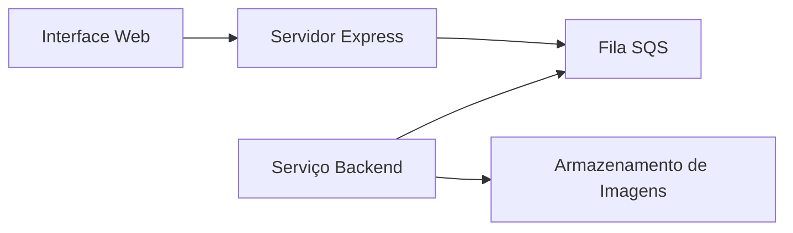

# Exemplo SQS - Gerador de Imagens

Este projeto demonstra o uso do AWS SQS (Simple Queue Service) com uma aplicação frontend solicitando geração de imagens e um serviço backend processando essas solicitações.

## Arquitetura

O projeto consiste em dois componentes principais:
- Frontend (servidor Express.js + Interface Web)
- Backend (serviço de geração de imagens)

Estes componentes se comunicam através de uma fila AWS SQS.



## Pré-requisitos

- Node.js
- LocalStack (para serviços AWS locais)
- AWS CLI (configurado para LocalStack)

## Estrutura do Projeto

```
sqs-example/
├── frontend/
│   ├── index.js        # Servidor Express
│   ├── index.html      # Interface Web
│   └── package.json
└── backend/
    ├── index.js        # Serviço de geração de imagens
    ├── package.json
    └── imagens/        # Armazenamento das imagens geradas
```

## Configuração

1. Instale as dependências:
```bash
# Frontend
cd frontend
npm install

# Backend
cd ../backend
npm install
```

2. Inicie o LocalStack e crie a fila SQS:
```bash
aws --endpoint-url=http://localhost:4566 sqs create-queue --queue-name sqsHello
```

3. Inicie os serviços:
```bash
# Iniciar frontend
cd frontend
node index.js

# Iniciar backend (em outro terminal)
cd backend
node index.js
```

## Como Usar

1. Acesse a interface web em `http://localhost:3000`
2. Digite o número desejado de imagens para gerar
3. Clique em "Gerar Imagens" para solicitar a geração
4. O serviço backend processará as solicitações a cada 2 minutos e salvará as imagens no diretório `backend/imagens`

## Detalhes da Implementação

- Frontend utiliza Alpine.js para UI reativa e Tailwind CSS para estilização
- Backend utiliza node-cron para processamento agendado
- As imagens são geradas usando a API Cat-as-a-service (cataas.com)
- A fila SQS está configurada com long polling de 5 segundos

## Tratamento de Erros

- Frontend trata erros no envio de mensagens SQS
- Backend inclui tratamento de erros para geração de imagens e processamento de mensagens
- Mensagens com falha permanecem na fila para nova tentativa

## Desenvolvimento Local

O projeto usa LocalStack para simular serviços AWS localmente. A URL da fila SQS está configurada para usar o endpoint do LocalStack:
`http://sqs.us-east-1.localhost.localstack.cloud:4566/000000000000/sqsHello`
